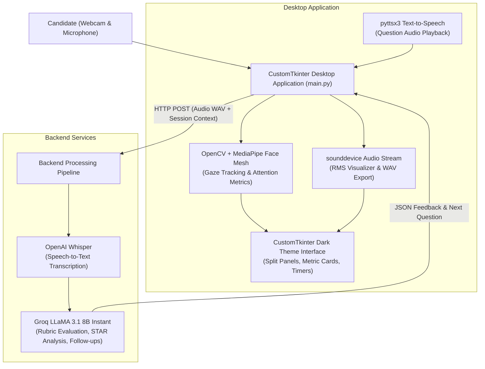

# AI Interview Assistant

A multimodal desktop mock interview platform featuring real-time Whisper speech-to-text, MediaPipe computer vision gaze tracking, adaptive Groq LLM evaluation, and CustomTkinter interface.


---

## Overview

The AI Interview Assistant is an intelligent desktop application engineered to simulate realistic technical and behavioral hiring interviews. Preparing for competitive engineering interviews requires both strong technical domain knowledge and disciplined delivery under observation. The application serves as an interactive artificial interviewer: it generates context-aware questions tailored to candidate roles and interviewer personas, captures microphone responses for Whisper transcription, monitors real-time eye contact and attention using MediaPipe Face Mesh, and analyzes responses via Groq's high-speed LLaMA inference engine. Candidates receive instant rubric-based scoring, STAR method breakdowns, and a comprehensive 7-day development roadmap upon interview completion.

---

## Features

- **Role & Persona Simulation:** Supports dedicated interview tracks (Software Engineer Intern, Frontend, Backend, Data Analyst, HR) customized with selectable personas (Strict Technical Lead, Friendly HR, Startup Founder, Calm Senior Engineer, Fast-paced Recruiter).
- **Multimodal Candidate Monitoring:**
  - **Computer Vision Pipeline:** Real-time OpenCV video stream with MediaPipe Face Mesh estimating eye contact stability, head orientation, and gaze engagement.
  - **Audio & RMS Visualization:** Real-time microphone buffer polling using `sounddevice` with dynamic level visualizers and offline `pyttsx3` text-to-speech engine.
- **Adaptive Questioning & Rubric Scoring:** Groq-accelerated LLaMA model evaluates technical accuracy, answer structure, STAR method adherence, delivery pace, and generates relevant follow-up questions.
- **Offline Fallback Architecture:** If remote API connectivity drops, the system falls back seamlessly to deterministic question sets and local metric calculations.
- **Session Persistence & Export:** Automatically archives conversation transcripts, audio metrics, rubric evaluations, and recommendations to structured JSON files on local disk.

---

## Architecture



---

## Hardware Requirements

| Component | Minimum Specification | Recommended |
|---|---|---|
| **Webcam** | 720p USB Camera (30 FPS) | 1080p Integrated or USB Camera |
| **Microphone** | Standard analog or USB mic | Noise-cancelling headset or USB condenser mic |
| **Audio Output** | Standard speakers or headphones | Headphones (prevents TTS feedback loop) |
| **Processor** | Dual-core x86_64 / Apple Silicon | Quad-core CPU with AVX support |
| **Memory** | 4 GB RAM | 8 GB RAM |

---

## Software & Dependencies

- **Programming Language:** Python 3.10+
- **Primary Libraries:**
  - `customtkinter` — Modern themed desktop widget toolkit
  - `opencv-python` (`cv2`) & `mediapipe` — Video capture and face landmark tracking
  - `sounddevice` & `scipy` — Audio recording and WAV file encoding
  - `pyttsx3` — Multiplatform offline text-to-speech synthesis
  - `requests` — HTTP communication with backend API
  - `Pillow` — Image handling and canvas rendering

---

## Project Structure

```
AI_Interview_Assistant/
├── main.py                 # Complete CustomTkinter desktop application
├── backend.ipynb           # Colab backend notebook for Whisper & Groq API
├── requirements.txt        # Python dependency manifest
├── .gitignore              # Git ignore rules for cached models and sessions
└── README.md               # Complete engineering documentation
```

---

## Setup and Usage

### 1. Clone Repository & Install Dependencies
```bash
git clone https://github.com/saptarshidas578/AI_Interview_Assistant.git
cd AI_Interview_Assistant

# Create virtual environment (recommended)
python -m venv venv
# On Windows:
venv\Scripts\activate
# On Linux/macOS:
source venv/bin/activate

# Install dependencies
pip install -r requirements.txt
```

### 2. Configure Backend Server
Open and execute `backend.ipynb` in Google Colab (or local Jupyter environment) with your Groq API key configured. Copy the generated public ngrok URL.

### 3. Launch Desktop Application
```bash
python main.py
```
- Paste the backend server URL into the **Backend URL** field in the application sidebar.
- Select your target **Role**, **Interviewer Persona**, and **Interview Mode**.
- Click **Start Interview**, speak into your microphone when prompted, and click **Submit Answer** to receive real-time feedback.

---

## Evaluation Rubric Dimensions

Each candidate response is scored across 6 dimensions:
1. **Relevance:** Direct addressing of the core interview prompt.
2. **Clarity:** Coherent, articulate phrasing and sentence structure.
3. **Structure & STAR Method:** Logical Situation, Task, Action, Result framework.
4. **Technical Depth:** Accuracy and depth of underlying engineering concepts.
5. **Delivery & Pacing:** Speaking speed (WPM) and reduction of filler pauses.
6. **Engagement:** Gaze direction and camera attention maintained during turn.

---

## Future Work

- [ ] Support local Whisper inference via `whisper.cpp` or `faster-whisper` for full offline capability without cloud backend.
- [ ] Resume PDF parsing to automatically generate personalized resume-based interrogation questions.
- [ ] Voice stress and prosody analysis for enhanced delivery feedback.

---

## Author & Contact

- **Author:** [saptarshi2007 (saptarshidas578)](https://github.com/saptarshidas578)
- **Institution:** B.Tech Electrical & Computer Science Engineering, VIT Vellore
- **LinkedIn:** TODO(author): https://www.linkedin.com/in/saptarshi-das-3255673a1/

---

## License

[MIT License](https://opensource.org/licenses/MIT).  

